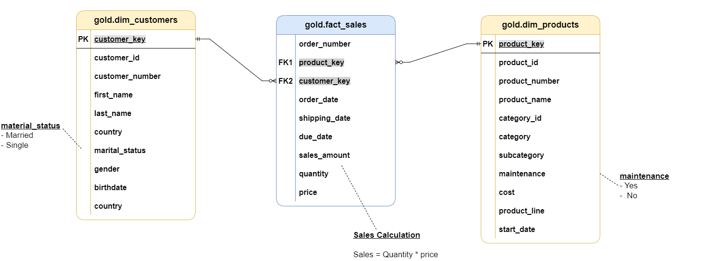

cat > README.md << 'EOF'
# 🏗️ Customer Sales Data Warehouse  

### 📚 Overview  
This project builds an **end-to-end Data Warehouse solution** integrating **CRM and ERP systems** into a single source of truth for business analytics.  
It follows the **Bronze → Silver → Gold layered architecture** and demonstrates a complete **ETL + Data Modeling + BI Visualization** workflow using **SQL Server** and **Power BI**.

---

## 🧩 Architecture Overview  

### 🔄 Data Flow  
The data flows from multiple source systems (CRM, ERP) into structured layers of the warehouse.  

📁 **Sources:**  
- CRM: Customer and Sales data  
- ERP: Product, Location, and Customer Info data  

🗂️ **Layers:**  
1. **Bronze Layer** → Raw data ingestion  
2. **Silver Layer** → Data cleansing & standardization  
3. **Gold Layer** → Business-ready data for reporting  


---

## 🧱 Data Warehouse Architecture  

This shows how data moves from raw sources through transformation stages before being consumed for reporting or ML.  


---

## 💡 Data Modeling (Gold Layer)  

The **Gold Layer** follows a **Star Schema**, consisting of:  
- **Fact Table:** `fact_sales`  
- **Dimension Tables:** `dim_customers`, `dim_products`  

**Relationships:**  
- Each sale links to a customer and product using surrogate keys.  

📸 **Add this image below:**  


---

## 🧮 Layers Description  

### 🥉 Bronze Layer (Raw Data)
- Data from CRM and ERP CSVs is loaded “as-is”.
- Stored in corresponding tables:
  - `crm_sales_details`
  - `crm_cust_info`
  - `crm_prd_info`
  - `erp_cust_az12`
  - `erp_loc_a101`
  - `erp_px_cat_g1v2`

**Purpose:** Preserve raw data for traceability and reprocessing.

---

### 🥈 Silver Layer (Cleaned Data)
- Cleansed and standardized tables with validated data types.
- Handles:
  - Data quality checks  
  - Standardization of column names  
  - Removal of duplicates and nulls  

**Transformations:**  
- Data Cleansing  
- Standardization  
- Derived columns  

---

### 🥇 Gold Layer (Business Data)
- Final, business-ready data stored as **views**:
  - `gold.dim_customers`  
  - `gold.dim_products`  
  - `gold.fact_sales`  

**Transformations:**  
- Data integration from multiple sources  
- Calculations for sales, quantities, and metrics  
- Business rules applied  

---

## 📊 Power BI Dashboard  

The Power BI report visualizes key business metrics and insights from the **Gold Layer**.

### **Dashboard Includes:**

**KPI Cards:**  
- 💰 **Total Sales**  
- 📦 **Total Orders**  
- 🧮 **Total Quantity**  
- 💲 **Average Price**  

**Charts:**  
- 📊 **Sales by Product Category** *(Bar Chart)*  
- 🌍 **Sales by Country** *(Bar Chart)*  
- 📈 **Sales Trend Over Time** *(Line Chart)*  

**Slicers / Filters:**  
- 🏷️ Product Line  
- 🌎 Country  
- 🧩 Category  

**🎨 Styling:**  
- Background: Light Gray `#F7F9FB`  
- Consistent fonts and colors  
- Minimalistic visual design  

**⚙️ Interactivity:**  
- Dynamic slicers automatically update KPIs and charts  
- Drill-down and sorting enabled for deeper analysis  

📸 **Optional:** Add a screenshot of your dashboard below.  


---

## 🧰 Tech Stack  

| Layer | Tool / Technology |
|-------|--------------------|
| Data Source | CSV Files (CRM, ERP) |
| Data Storage | SQL Server |
| ETL Processing | SQL Stored Procedures |
| Data Modeling | Star Schema |
| Visualization | Power BI |

---

## 🚀 Project Setup  

1. **Create the Database**
   ```sql
   CREATE DATABASE DataWarehouse;
